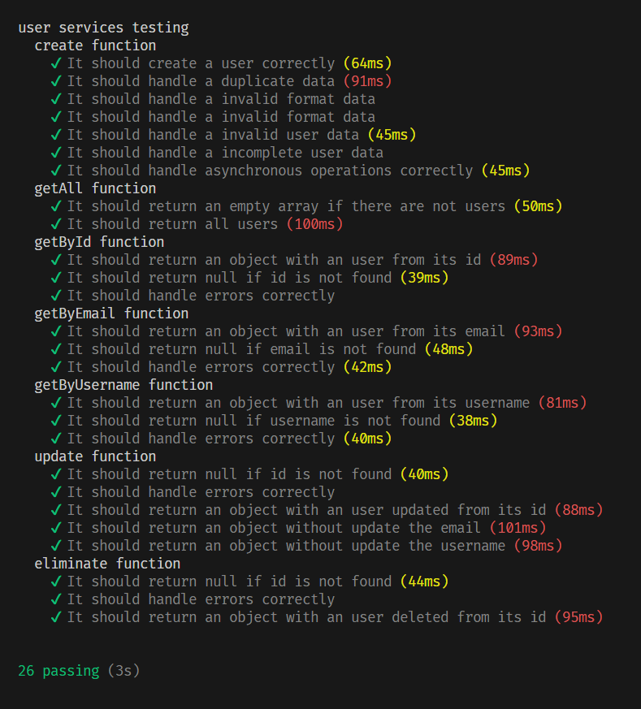

# Car Service Data - API

##

### Está desarrollada para llevar el control de mantenimientos y vencimientos de documentación de vehículos.

Con **_Car Service Data_** vas a poder llevar el control de tanto todos los mantenimientos hechos y por hacer, como de los vencimientos de documentación, como ser seguro, patente, licencias, etc.
La misma cuenta con avisos de mantenimientos o vencimientos mediante [email](https://nodemailer.com/) y/o [whattsapp](https://business.whatsapp.com/developers/developer-hub?lang=es_LA).

Para operar con Car Service Data contarás un inicio de sesión mediante [Passport](https://www.passportjs.org/tutorials/password/) ara tener la seguridad de que solo tú tienes acceso a los datos de tus vehículos, y [bcrypt](https://www.npmjs.com/package/bcrypt) para encriptación de contraseñas.
La persistencia de datos se realiza mediante [MongoDB](https://account.mongodb.com/account/login?n=https%3A%2F%2Fcloud.mongodb.com%2Fv2%2F6483b1c9bee31d15ef11b182&nextHash=%23clusters&signedOut=true).

### **Estructura de las rutas de vehículos**

| **Método** | **Ruta**                                      | **Descripción**                      |
| ---------- | --------------------------------------------- | ------------------------------------ |
| `POST`     | `/v1/api/vehicles`                            | Crear un nuevo vehículo.             |
| `GET`      | `/v1/api/vehicles`                            | Obtener todos los vehículos.         |
| `GET`      | `/v1/api/vehicles/:id`                        | Obtener un vehículo por ID.          |
| `GET`      | `/v1/api/vehicles/registration/:registration` | Obtener un vehículo por registro.    |
| `PATCH`    | `/v1/api/vehicles/:id`                        | Actualizar un vehículo por ID.       |
| `PATCH`    | `/v1/api/vehicles/registration/:registration` | Actualizar un vehículo por registro. |
| `DELETE`   | `/v1/api/vehicles/:id`                        | Eliminar un vehículo por ID.         |

Testing: 
